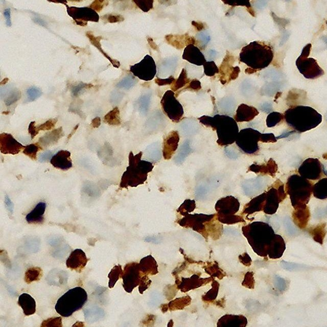
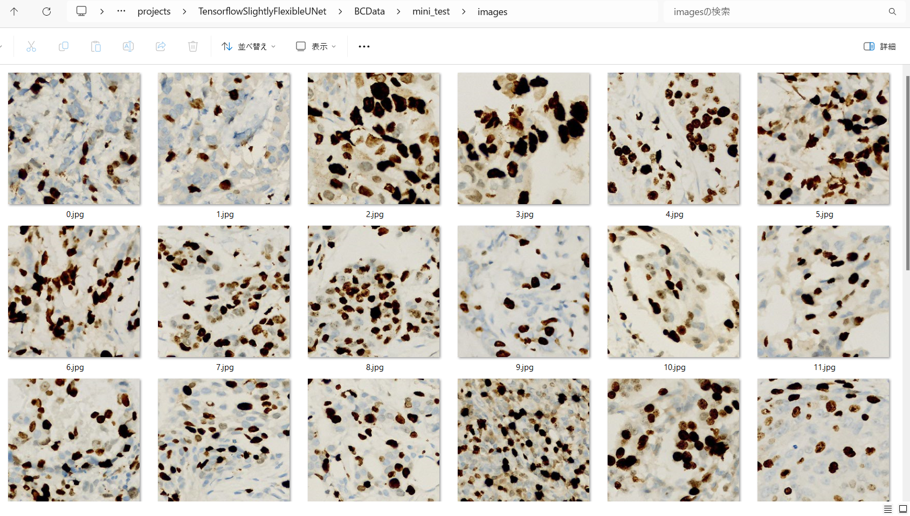
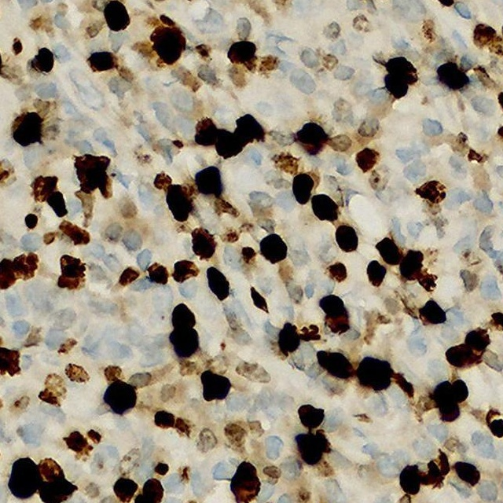

<h2>Tensorflow-Image-Segmentation-Augmented-BCData (2024/07/04)</h2>

This is the first experiment of Image Segmentation for BCData (A Large-Scale Dataset and Benchmark for Cell Detection and Counting 
) Images based on
the <a href="https://github.com/sarah-antillia/Tensorflow-Image-Segmentation-API">Tensorflow-Image-Segmentation-API</a>, and
<a href="https://drive.google.com/file/d/1J62EHi0JLDfL-lVPkN_W7KXaeOEVOrWC/view?usp=sharing">
BCData-ImageMask-Dataset-V1.zip</a>
, which was derived by us from the original <a href="https://drive.google.com/file/d/16W04QOR1E-G3ifc4061Be4eGpjRYDlkA/view?usp=sharing">BCData.zip</a>.
  

On BCData-ImageMask-Dataset, please refer to the repository <a href="https://github.com/sarah-antillia/ImageMask-Dataset-BCData">ImageMask-Dataset-BCData</a>.
As mentioned in the repository, the original h5 annotation files of BCData contain many points representing the center-like points of 
the cells, rather than polygons surrounding the whole cells. 
Consequently, all mask files in the BCData-ImageMask-Dataset were automatically generated by drawing white filled circles centered 
on these points defined in the h5 annotation files. While these masks are not precise and are considered pseudo annotations, 
they can still be used as the first step to train a BCData segmentation model. 
Please see also <a href="https://github.com/sarah-antillia/ImageMask-Dataset-BCData/blob/main/H5AnnotationParser.py">H5AnnotationParser.py</a>. 
  
 
 

<b>Actual Image Segmentation for 640x640 images</b> 
As shown below, the <b>Circled pointwise masks</b>, which were created by us using  
<a href="https://github.com/sarah-antillia/ImageMask-Dataset-BCData/blob/main/ImageMaskDatasetGenerator.py">
ImageMaskDatasetGenerator.py</a>, are not precise filled polygonal annotations for the black cells in the <b>Input images</b>.
However, the white regions of the inferred masks predicted by our segmentation model look slightly better approximations than the pointwise masks 
to the black cells in the images. 
Probably, we are able to replace the original pseudo annotations (circled pointwise masks) with the inferred masks   
to get more precise annotations. 
  
   
 
<table>
<tr>
<th>Input image</th>
<th>Circled pointwise mask</th>
<th>Prediction: inferred_mask</th>
</tr>
<tr>
<td></td>
<td></td>
<td></td>
</tr>

<tr>
<td></td>

<td></td>
<td></td>
</tr>
</table>

 
In this experiment, we used the simple UNet Model 
<a href="./src/TensorflowUNet.py">TensorflowSlightlyFlexibleUNet</a> for this BCData Segmentation. 
As shown in <a href="https://github.com/sarah-antillia/Tensorflow-Image-Segmentation-API">Tensorflow-Image-Segmentation-API</a>.
you may try other Tensorflow UNet Models: 

<li><a href="./src/TensorflowSwinUNet.py">TensorflowSwinUNet.py</a></li>
<li><a href="./src/TensorflowMultiResUNet.py">TensorflowMultiResUNet.py</a></li>
<li><a href="./src/TensorflowAttentionUNet.py">TensorflowAttentionUNet.py</a></li>
<li><a href="./src/TensorflowEfficientUNet.py">TensorflowEfficientUNet.py</a></li>
<li><a href="./src/TensorflowUNet3Plus.py">TensorflowUNet3Plus.py</a></li>
<li><a href="./src/TensorflowDeepLabV3Plus.py">TensorflowDeepLabV3Plus.py</a></li>

 

<h3>1. Dataset Citation</h3>
<a href="https://link.springer.com/chapter/10.1007/978-3-030-59722-1_28">
BCData: A Large-Scale Dataset and Benchmark for Cell Detection and Counting</a> 
Medical Image Computing and Computer Assisted Intervention – MICCAI 2020, 2020, Volume 12265 
ISBN : 978-3-030-59721-4 

Zhongyi Huang, Yao Ding, Guoli Song, Lin Wang, Ruizhe Geng, Hongliang He, Shan Du, Xia Liu,  
Yonghong Tian, Yongsheng Liang, S. Kevin Zhou & Jie Chen 

 

<h3>
<a id="2">
2 BCData ImageMask Dataset
</a>
</h3>
 If you would like to train this BCData Segmentation model by yourself,
 please download the dataset from the google drive 
<a href="https://drive.google.com/file/d/1J62EHi0JLDfL-lVPkN_W7KXaeOEVOrWC/view?usp=sharing">
BCData-ImageMask-Dataset-V1.zip</a>
 
 

Please expand the downloaded ImageMaskDataset and place them under <b>./dataset</b> folder to be
<pre>
./dataset
└─BCData
    ├─test
    │   ├─images
    │   └─masks
    ├─train
    │   ├─images
    │   └─masks
    └─valid
        ├─images
        └─masks
</pre>
 

<b>BCData Dataset Statistics</b> 
 
 
As shown above, the number of images of train and valid dataset is not necessarily large. Therefore, probably an online augmentation strategy to
train this model may be effective to improve segmentation accuracy.
 

 
<b>Train_images_sample</b> 

 
<b>Train_masks_sample</b> 

 

<h3>
4 Train TensorflowUNet Model
</h3>
 We have trained BCData TensorflowUNet Model by using the following
<a href="./projects/TensorflowSlightlyFlexibleUNet/BCData/train_eval_infer.config"> <b>train_eval_infer.config</b></a> file.  
Please move to <i>./projects/TensorflowSlightlyFlexibleUNet/BCData/</i> and run the following bat file. 
<pre>
>1.train.bat
</pre>
, which simply runs the following command. 
<pre>
>python ../../../src/TensorflowUNetTrainer.py ./train_eval_infer.config
</pre>
<pre>
; train_eval_infer.config
; 2024/07/04 (C) antillia.com

[model]
model         = "TensorflowUNet"
generator     = True
image_width    = 640
image_height   = 640
image_channels = 3
input_normalize = False
normalization  = False
num_classes    = 1
base_filters   = 16
base_kernels   = (5,5)
num_layers     = 7
dropout_rate   = 0.05
learning_rate  = 0.0001
clipvalue      = 0.5
dilation       = (2,2)
;loss           = "bce_iou_loss"
loss           = "bce_dice_loss"
metrics        = ["binary_accuracy"]
show_summary   = False

[train]
epochs        = 100
batch_size    = 2
steps_per_epoch  = 200
validation_steps = 80
patience      = 10

;metrics       = ["iou_coef", "val_iou_coef"]
metrics       = ["binary_accuracy", "val_binary_accuracy"]
model_dir     = "./models"
eval_dir      = "./eval"
image_datapath = "../../../dataset/BCData/train/images/"
mask_datapath  = "../../../dataset/BCData/train/masks/"

;Inference execution flag on epoch_changed
epoch_change_infer     = True

; Output dir to save the inferred masks on epoch_changed
epoch_change_infer_dir =  "./epoch_change_infer"

;Tiled-inference execution flag on epoch_changed
epoch_change_tiledinfer     = False

; Output dir to save the tiled-inferred masks on epoch_changed
epoch_change_tiledinfer_dir =  "./epoch_change_tiledinfer"

; The number of the images to be inferred on epoch_changed.
num_infer_images       = 1
create_backup  = False

learning_rate_reducer = True
reducer_factor     = 0.3
reducer_patience   = 4
save_weights_only  = True

[eval]
image_datapath = "../../../dataset/BCData/validation/images/"
mask_datapath  = "../../../dataset/BCData/validation/masks/"

[test] 
image_datapath = "../../../dataset/BCData/test/images/"
mask_datapath  = "../../../dataset/BCData/test/masks/"

[infer] 
images_dir    = "./mini_test/images"
output_dir    = "./mini_test_output"
merged_dir    = "./mini_test_output_merged"
;blur          = True

[tiledinfer] 
overlapping   = 128
images_dir    = "./mini_test/Metaplastic/images"
output_dir    = "./tiled_mini_test_output"
merged_dir    = "./tiled_mini_test_output_merged"
bitwise_blending = False

;binarize      = True
mask_colorize = True

[segmentation]
colorize      = False
black         = "black"
white         = "green"
blursize      = None

[mask]
blur      = True
blur_size = (3,3)
binarize  = False
;threshold = 128
threshold = 80

[generator]
debug        = False
augmentation = True

[augmentor]
vflip    = True
hflip    = True
rotation = True
angles   = [30, 60, 90, 120, 150, 180, 210, 240, 270, 300, 330]
shrinks  = [0.6, 0.8]
shears   = [0.1]

deformation = True
distortion  = True
sharpening  = False
brightening = False
; 2024/07/04
barrdistortion = True

[deformation]
alpah     = 1300
sigmoids  = [8.0]

[distortion]
gaussian_filter_rsigma= 40
gaussian_filter_sigma = 0.5
distortions           = [0.02, 0.03]

[barrdistortion]
radius = 0.3
amount = 0.3
centers =  [(0.3, 0.3), (0.7, 0.3), (0.5, 0.5), (0.3, 0.7), (0.7, 0.7)]

[sharpening]
k        = 1.0

[brightening]
alpha  = 1.2
beta   = 10  
</pre>
In this configuration file above, we added the following parameters to enable <b>epoch_change_infer</b> callback in [train] section. 
<pre>
[train]
;Inference execution flag on epoch_changed
epoch_change_infer     = True
; Output dir to save the inferred masks on epoch_changed
epoch_change_infer_dir =  "./epoch_change_infer"

; The number of the images to be inferred on epoch_changed.
num_infer_images       = 1
</pre>

By using this callback, on every epoch_change, the inference procedures can be called
 for an image in <b>mini_test</b> folder.  
<b>Epoch_change_inference output</b> 
 
 
 
The training process has just been stopped at epoch 35 by an early-stopping callback as shown below.  
 
 
 
<a href="./projects/TensorflowSlightlyFlexibleUNet/BCData/eval/train_metrics.csv">train_metrics.csv</a> 
 

 
<a href="./projects/TensorflowSlightlyFlexibleUNet/BCData/eval/train_losses.csv">train_losses.csv</a> 
 
 

<h3>
5 Evaluation
</h3>
Please move to a <i>./projects/TensorflowSlightlyFlexibleUNet/BCData</i> folder, 
and run the following bat file to evaluate TensorflowUNet model for BCData. 
<pre>
./2.evaluate.bat
</pre>
<pre>
python ../../../src/TensorflowUNetEvaluator.py ./train_eval_infer_aug.config
</pre>
Evaluation console output: 

  
<a href="./projects/TensorflowSlightlyFlexibleUNet/BCData/evaluation.csv">evaluation.csv</a> 
The loss (bce_dice_loss) for the <a href="./dataset/BCData/test">test</a> dataset is not so low. 
<pre>
loss,0.2234
binary_accuracy,0.9264
</pre>

 
<h3>
6 Inference
</h3>
Please move to a <i>./projects/TensorflowSlightlyFlexibleUNet/BCData</i> folder
, and run the following bat file to infer segmentation regions for the images 
in <a href="./projects/TensorflowSlightlyFlexibleUNet/BCData/mini_test/images"><b>mini_test/images</b></a> by the Trained-TensorflowUNet model for Camelyon. 
<pre>
./3.infer.bat
</pre>
<pre>
python ../../../src/TensorflowUNetInferencer.py ./train_eval_infer_aug.config
</pre>
The <a href="./projects/TensorflowSlightlyFlexibleUNet/BCData/mini_test/"><b>mini_test</b></a>
folder contains some large image and mask files taken from the original BCSS dataset.  

<b>mini_test_images</b> 
 
 
<b>mini_test_mask(circled-pointwise-mask)</b> 
 

<b>inferred mini_test masks</b> 
 
 

<b>Enlarged Masks Comparison</b> 

<table>
<tr>
<th>Image</th>
<th>Mask (ground_truth)</th>
<th>Inferred-mask</th>
</tr>

<tr>
<td></td>
<td></td>
<td></td>
</tr>

<tr>
<td></td>
<td></td>
<td></td>
</tr>

<tr>
<td></td>
<td></td>
<td></td>
</tr>

<tr>
<td></td>
<td></td>
<td></td>
</tr>

<tr>
<td></td>
<td></td>
<td></td>
</tr>
</table>
 

<h3>
References
</h3>
<b>1. BCData: A Large-Scale Dataset and Benchmark for Cell Detection and Counting </b> 
<pre>
https://sites.google.com/view/bcdataset
</pre>

 
<b>2. Image-MaskDataset-BCData</b> 
Toshiyuki Arai @antillia.com  
<pre>

https://github.com/sarah-antillia/ImageMask-Dataset-BCData
</pre>

